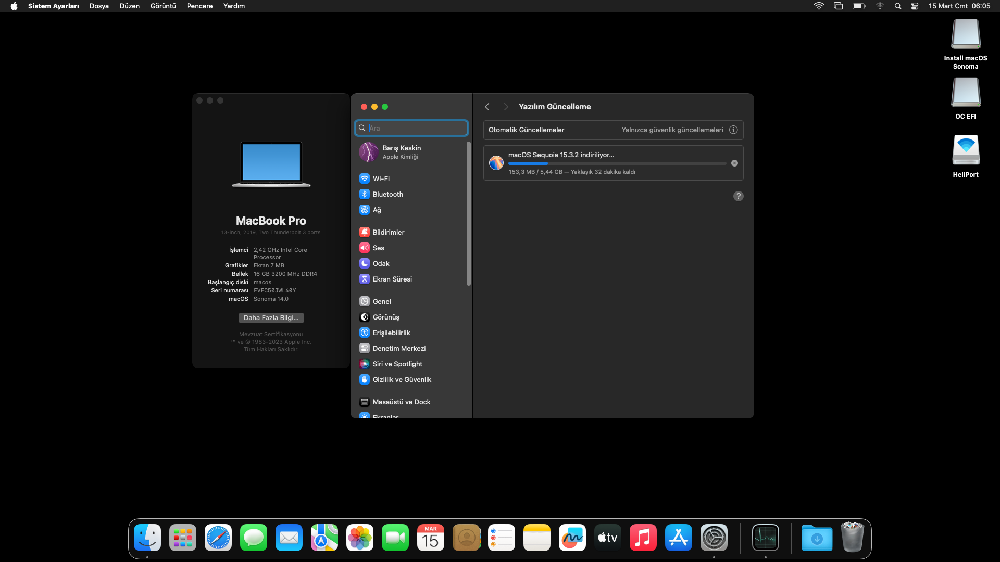

# Hackintosh EFI README

### Lenovo Ideapad 5 14ITL05 (i5-1135G7, Tiger Lake) Mackintosh EFI

---

---

I found and tested the EFI files to get a MacOS experience and to attend a mobile app development course using my laptop.

### **System specification**

---

- **Device Model:** Lenovo Ideapad 5 14ITL05
- **CPU:** Intel Core i5-1135G7
- GPU: Intel Iris Xe Graphics, NVIDIA GeForce MX450
- RAM: 16GB
- Storage: 1 TB Nvme

### Working

---

- Wi-Fi (For the macOS versions I used, you may need to run the HeliPort app. See: https://openintelwireless.github.io/HeliPort/Installation.html )
- USB Ports
- Integrated Webcam
- Battery Percentage Indication

### Not Working

---

- GPU
- Touchpad
- Audio
- Microphone
- Brightness Control
- Fn Keys (Volume keys work, but the sound itself is not functioning.))

### **Installation Notes**

---
